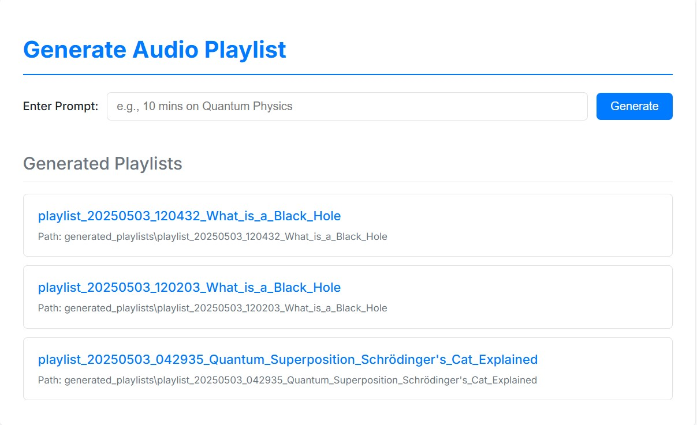

# 🎧 Spotify for Learning: AI Audio Playlist Generator

Transform your learning on the go! This project leverages AI to generate personalized audio playlists from your prompts, creating bite-sized educational content perfect for your commute, workout, or any time you have a few minutes to spare.



## ✨ Features

-   **AI-Powered Content:** Utilizes advanced AI models to understand your learning goals from a simple text prompt.
-   **Personalized Playlists:** Generates custom audio scripts tailored to your specified topic and time limit.
-   **Text-to-Speech Conversion:** Automatically converts the generated scripts into high-quality, listenable audio files.
-   **Interactive Web UI:** A clean and simple web interface built with Flask to input your prompts and listen to the results.
-   **Dynamic & On-the-Go Learning:** Perfect for fitting learning into a busy schedule.

## 🚀 Getting Started

Follow these steps to get the application up and running on your local machine.

### 1. Prerequisites

-   Python 3.7+
-   API keys for:
    -   Google Generative AI
    -   Tavily
    -   ElevenLabs

### 2. Installation & Setup

**Step 1: Clone the repository**
```bash
git clone [https://github.com/your-username/Spotify_For_Learning.git](https://github.com/your-username/Spotify_For_Learning.git)
cd Spotify_For_Learning
```

**Step 2: Install dependencies**
It's recommended to use a virtual environment.
```bash
python -m venv venv
source venv/bin/activate  # On Windows, use `venv\Scripts\activate`
pip install -r requirements.txt
```
*(Note: If a `requirements.txt` file is not available, you will need to install Flask manually: `pip install Flask`)*

**Step 3: Set up your environment variables**
Create a file named `.env` in the root directory and add your API keys:
```
GOOGLE_API_KEY="YOUR_GOOGLE_API_KEY"
TAVILY_API_KEY="YOUR_TAVILY_API_KEY"
ELEVEN_API_KEY="YOUR_ELEVENLABS_API_KEY"
```
**Important:** Ensure the `.env` file is correctly configured with your valid API keys before proceeding.

### 3. Running the Application

1.  Execute the main application file:
    ```bash
    python app.py
    ```
2.  Once running, a local server address will appear in your terminal (e.g., `* Running on http://127.0.0.1:5000`).
3.  Open this link in your web browser to start generating your learning playlists!

## 🤖 Example Usage

Here’s how you can use the app. Simply provide a prompt that specifies your topic of interest and a time constraint.

**Example Prompt:**
> I have 15 mins to reach home. I want to learn about black holes.

The application will then process this prompt, generate a script, and create a series of audio segments that fit your 15-minute timeframe.

### Example Audio Output

You can listen to the generated audio files directly in the web interface. For demonstration, here are some example segments based on the prompt above:

* [🎧 **Segment 1:** What is a Black Hole?](./example_audio/segment_1_What_is_a_Black_Hole.mp3)
* [🎧 **Segment 2:** The Life Cycle of Stars and Black Hole Formation](./example_audio/segment_2_The_Life_Cycle_of_Stars_and_Black_Hole_Formation.mp3)
* [🎧 **Segment 3:** Exploring Black Hole Effects: Gravity and Time](./example_audio/segment_3_Exploring_Black_Hole_Effects_Gravity_and_Time.mp3)

*Note: The actual audio files generated will vary based on the prompt. All new playlists are saved in the `generated_playlists/` directory.*

## 📂 Project Structure

```
.
├── app.py                  # Main Flask application file
├── model_wt_audio_2.py     # Core logic for prompt processing and audio generation
├── .env                    # Environment variables for API keys
├── templates/              # HTML files for the web UI
├── static/                 # CSS and other static assets
├── generated_playlists/    # Output directory for generated audio files (created automatically)
└── example_audio/          # Sample audio files for demonstration
```
